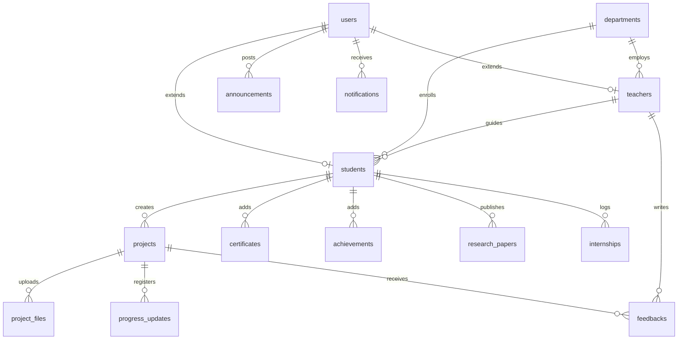
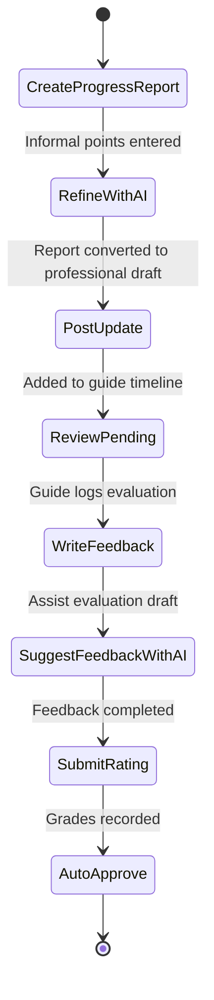
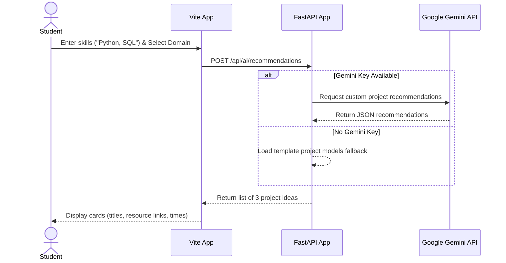

# ProjectHub AI – Student Project Tracking and Portfolio Management System

ProjectHub AI is a responsive, modern full-stack web application designed for colleges to manage, monitor, evaluate, and track student projects from the first year through the final year. It provides role-based access control with custom dashboards for Students, Teachers, HODs, and Administrators.

---

## Technical Stack
* **Frontend:** React.js, Vite, Tailwind CSS, React Router, Axios, Framer Motion, Chart.js, React Hook Form, Lucide Icons.
* **Backend:** FastAPI (Python), REST APIs, JWT Authentication, SQLAlchemy ORM, Pandas, openpyxl, reportlab.
* **Database:** MySQL.
* **AI Integration:** Google Gemini API (Mock mode enabled if key is omitted).

---

## Installation & Running

### Option 1: Quick Docker Deployment (Recommended)
Make sure you have Docker and Docker Compose installed.

1. Create a `.env` file inside `backend/` with your credentials:
   ```bash
   DATABASE_URL=mysql+pymysql://user:password@db/projecthub
   SECRET_KEY=yoursupersecretkey
   GEMINI_API_KEY=your_gemini_api_key_here
   ```
2. Start the services:
   ```bash
   docker-compose up --build
   ```
3. Open your browser:
   * Frontend: `http://localhost:5173`
   * Backend API / Docs: `http://localhost:8000/docs`

### Option 2: Manual Local Launch
#### 1. Database Setup
Ensure you have MySQL running and create the database `projecthub`. Run the database schema in `init-db/init.sql` to setup schemas and initial seed data.

#### 2. Start Backend
```bash
cd backend
python -m venv venv
source venv/bin/activate # Or venv\Scripts\activate on Windows
pip install -r requirements.txt
# Create a local .env file
uvicorn app.main:app --reload
```

#### 3. Start Frontend
```bash
cd frontend
npm install
npm run dev
```

---

## Seeding & Test Credentials
The database seeds default accounts. All accounts use the password: `password123`

* **Admin Portal:** `admin@college.edu`
* **HOD Portal:** `sarah.connor@college.edu`
* **Teacher Portal:** `alan.turing@college.edu`
* **Student Portal:** `student.cse@college.edu` or `student.ai@college.edu`

---

## System Diagrams

### 1. Database Entity-Relationship (ER) Diagram


### 2. UML Use Case Diagram
```mermaid
left_to_right_direction
actor Student
actor Teacher
actor HOD
actor Admin

rectangle ProjectHub_AI {
  usecase "Propose Project" as UC1
  usecase "Upload Weekly Progress" as UC2
  usecase "Generate AI Portfolio Description" as UC3
  usecase "Review & Mark Projects" as UC4
  usecase "Generate AI Feedback" as UC5
  usecase "Schedule Advisor Session" as UC6
  usecase "Monitor Department Stats" as UC7
  usecase "Download Academic Reports" as UC8
  usecase "Manage Users & Depts" as UC9
  usecase "Post Announcements" as UC10
}

Student --> UC1
Student --> UC2
Student --> UC3

Teacher --> UC4
Teacher --> UC5
Teacher --> UC6

HOD --> UC7
HOD --> UC8

Admin --> UC9
Admin --> UC10
```

### 3. Activity Diagram (Weekly Progress Update & Feedback)


### 4. Sequence Diagram (AI Project Recommendation Request)


---

## API Documentation Reference
### Auth Router
* `POST /api/auth/login` - Authenticates user. Body: `username`, `password` (Form data). Returns JWT Token, role, name.
* `POST /api/auth/register/student` - Registration form. Body: `StudentCreate` Pydantic model.
* `POST /api/auth/register/teacher` - Faculty form. Body: `TeacherCreate` Pydantic model.
* `GET /api/auth/me` - Resolves active session profile details.

### Project Router
* `POST /api/projects` - Propose a new project.
* `GET /api/projects` - Get all projects matching domain, category, status.
* `POST /api/projects/{id}/progress` - Add a weekly progress indicator update.
* `POST /api/projects/{id}/upload/{file_type}` - Upload report PDF or PPT presentations.
* `GET /api/projects/portfolio/{rollOrId}` - Retrieves full portfolio profile dataset by student roll/ID.

### AI Assistant Router
* `POST /api/ai/weekly-progress` - Convert bullet notes to professional paragraph.
* `POST /api/ai/recommendations` - Predict projects based on skills.
* `GET /api/ai/resume/{student_id}` - Generate resume markdown string.
